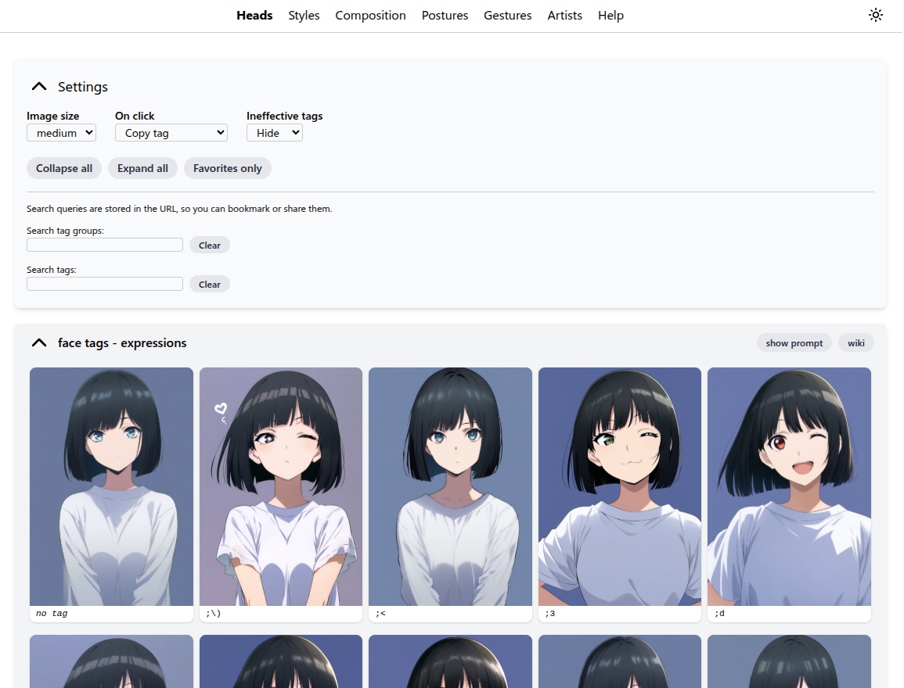

# https://tagexplorer.github.io

A convenient explorer for Danbooru tags that you can use on Danbooru-trained diffusion models.



To run the development server locally:

```
npm install
npm run dev
```

To build to `./dist`:

```
npm run build
npm run preview # preview your build locally
```

To run tests:

```
npm run test:visual
# or in Playwright UI mode
npm run test:visual:ui
```

To regen Playwright snapshots if you've confirmed the tests should pass:

```
npm run regen-screenshots
```
